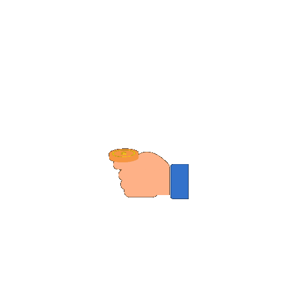

<div ></div>
<h2 align='center'> <a href="https://git.io/typing-svg"></a> </h2>  

<h3 align='center'><em>Remote Full-Stack software developer open for new opportunities</em> </h3>

***

<p align='center'>Let's connect and chat! Open to anything under the sun</p>


<div align='center'>

[](www.linkedin.com/in/vitalismutwiri/)
[](https://twitter.com/WilsonVitalis)

</div>

***


<div align='center' >

## More about me  

</div>


```javascript
const VitalisMutwiri = new Promise((resolve, reject) => {
  resolve({
    lookingFor : 'Full-stack developer' || 'Front-end developer',
    stack : [JavaScript, MERN, Ruby, Rails, HTML/CSS, SCSS, BOOTSTRAP, React JS, Next JS, Redux],
    askMeAbout : [sound engineering, mentoring, karate, salsa],
    currentlyStuding: 'Microverse - an intense remote software engineering school,
    which incorparates 8 hrs learning every day,
    with collaboration among cross-curtural peers and working on real-world landing pages and e-commerce applications',
    funFacts : [
    'devops savvy',
    'MERN enthusiast',
    'completed fully functional e-commerce applications such as Amazon',
    'ready to wire up to the right offer'
    ],
  })

  reject("No Regret");
})

```

***

[](https://github.com/svitalis123/github-readme-stats)

---

<p>You can check out my portfolio <a href="https://relaxed-crisp-41566e.netlify.app/">here</a></p>
<!--
**svitalis123/svitalis123** is a ✨ _special_ ✨ repository because its `README.md` (this file) appears on your GitHub profile.
Here are some ideas to get you started:
- 🔭 I’m currently working on ...
- 🌱 I’m currently learning ...
- 👯 I’m looking to collaborate on ...
- 🤔 I’m looking for help with ...
- 💬 Ask me about ...
- 📫 How to reach me: ...
- 😄 Pronouns: ...
- ⚡ Fun fact: ...
-->
